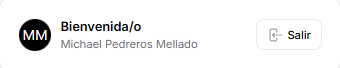
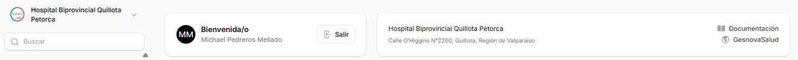
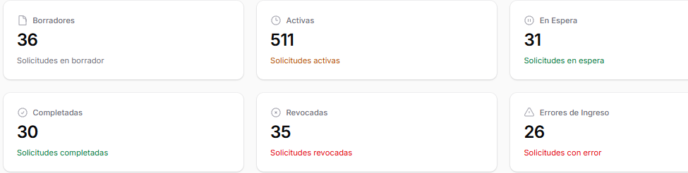

# Escritorio

## Descripción General
El Escritorio es la página principal de la aplicación. Al ingresar, muestra un resumen completo del estado de las solicitudes del hospital y proporciona acceso rápido a la documentación y otros recursos.

## Sección de Usuario
En la parte superior izquierda se muestra:
- **Mensaje de bienvenida**: "Bienvenida/o" seguido del nombre del usuario
- **Avatar**: Círculo con las iniciales del usuario
- **Nombre completo**: Nombre y apellidos del usuario que ha iniciado sesión

## Información del Hospital
En la parte superior central se presenta:
- **Nombre del hospital**: Hospital Biprovincial Quillota Petorca
- **Botón Salir**: Permite cerrar sesión
- **Dirección**: Calle O´Higgins -N°2200, Quillota, Región de Valparaíso
- **Enlaces rápidos**:
  - **Documentación**: Acceso a la documentación del sistema
  - **GesnovaSalud**: Enlace al sitio principal de GesnovaSalud

## Dashboard de Solicitudes
El escritorio muestra seis tarjetas con estadísticas en tiempo real sobre el estado de las solicitudes:

### Borradores
- **Contador**: Número de solicitudes en borrador
- **Descripción**: Solicitudes en borrador

### Activas
- **Contador**: Número de solicitudes activas
- **Descripción**: Solicitudes activas

### En Espera
- **Contador**: Número de solicitudes en espera
- **Descripción**: Solicitudes en espera

### Completadas
- **Contador**: Número de solicitudes completadas
- **Descripción**: Solicitudes completadas

### Revocadas en círculo
- **Contador**: Número de solicitudes revocadas
- **Descripción**: Solicitudes revocadas

### Errores de Ingreso
- **Contador**: Número de solicitudes con error
- **Descripción**: Solicitudes con error

## Funcionalidad
Las tarjetas del dashboard proporcionan una vista rápida del estado operativo del hospital, permitiendo identificar rápidamente:
- Cuántas solicitudes están pendientes de completar (Borradores)
- El volumen de trabajo activo (Activas)
- Las solicitudes que esperan atención (En Espera)
- El trabajo finalizado (Completadas)
- Solicitudes que han sido revocadas (Revocadas)
- Problemas que requieren atención inmediata (Errores de Ingreso)

## Disponibilidad de Pabellones
En Escritorio, también existe la posibilidad de visualizar la disponibilidad de los pabellones del hospital, referenciando si estan bloqueados por aseo o disponibles para su utilización.

