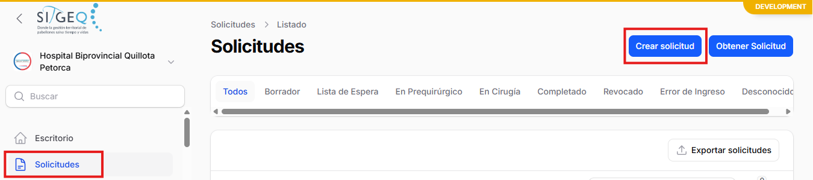
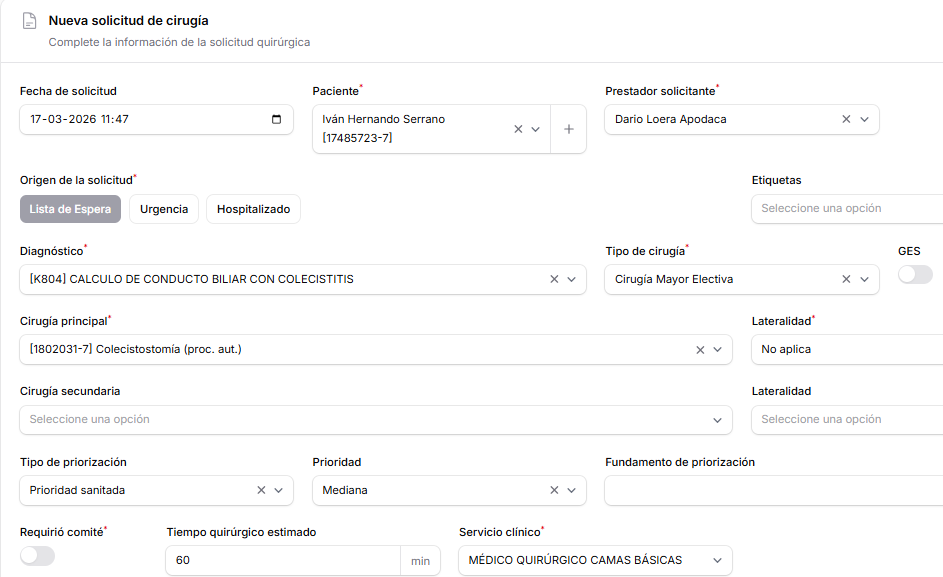
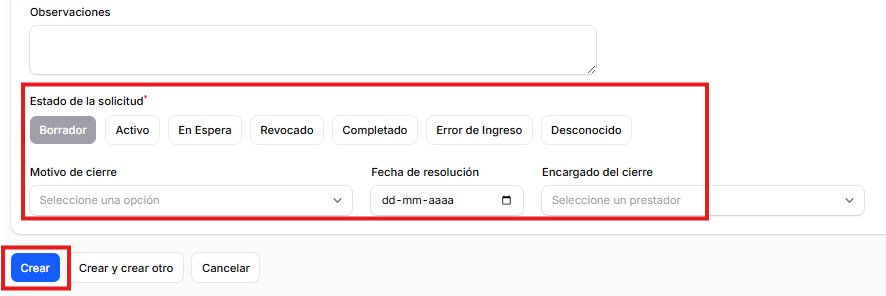
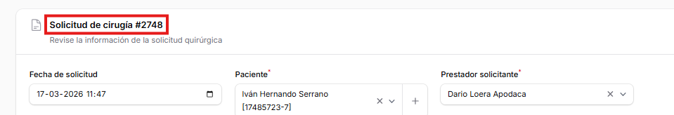
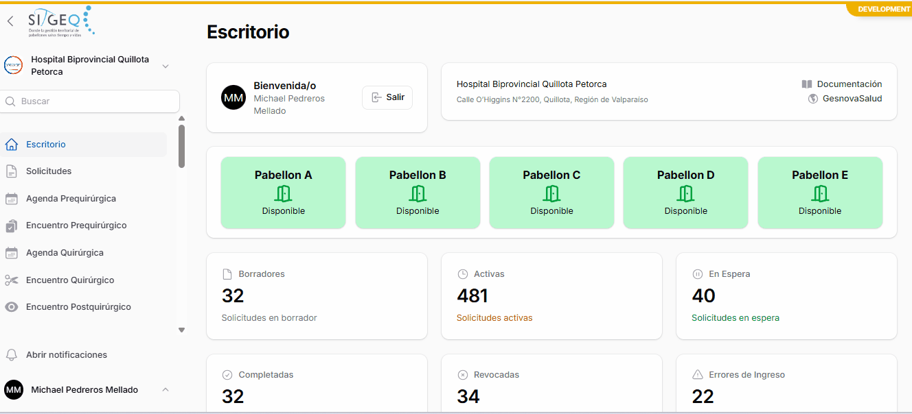
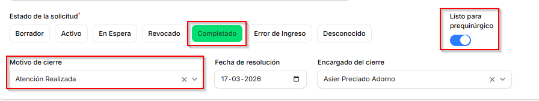

# Solicitudes
## Creación de nueva solicitud
Para crear una nueva solicitud, es necesario seleccionar dentro de menú "solicitudes" botón Crear solicitud.

Luego, en pantalla a continuación, se deberán completar los campos para generar solicitud. Los campos obligatorios del documento se identifican con un asterisco en la esquina superior de las opciones a completar.

Los estados de la solicitud van a depender del proceso que se este realizando, en primera instancia documento es guardado con estado "borrador", luego, misma solicitud puede ser editada para ir realizando gestión a la misma. Por último se debe presionar botón Crear.

Al presionar botón Crear, se generará un número de solicitud, el cuál será asignado a la creación realizada.

## Visualización de paso a paso

## Estado de la solicitud
Al momento de realizar gestión a las solicitudes emitidas, sistema permite cambiar de estado cada solicitud realizada, esto sirve de apoyo a la monitorización.
Para poder continuar con el siguiente proceso de agendamiento prequirúrgico, es necesario seleccionar check "Listo para prequirúrgico".
Sin este paso, no se visualizará paciente a la hora de realizar búsqueda de su solicitud.

