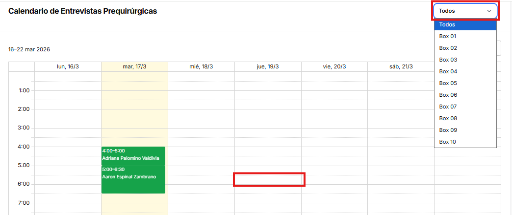
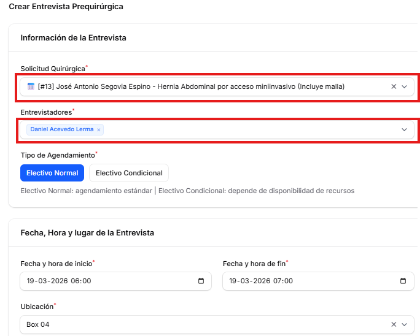
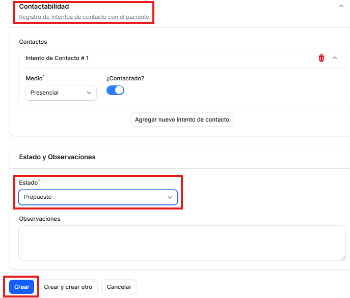
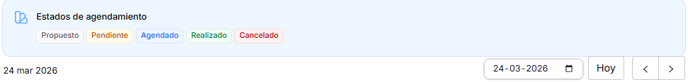
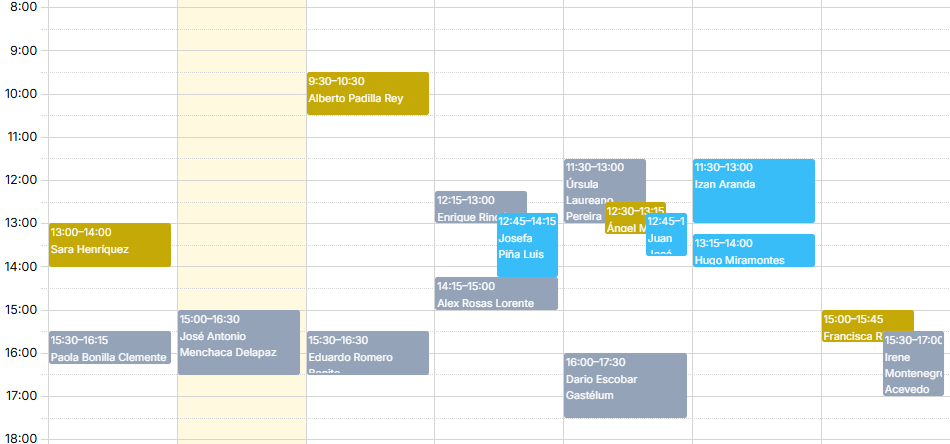

# Agenda Prequirúrgica

## Descripción General
La Agenda Prequirúrgica permite gestionar, planificar y evaluar las citas prequirúrgicas de los pacientes para tener una visualización propuesta. Esto conlleva a preparar la entrevista a pacientes mediante el equipo clínico a cargo, utilizando como detalle información clínica y demográfica.

## Funcionalidades Principales

### Crear Nueva Cita
Para la creación de una nueva cita, sistema permite seleccionar la visualización de todos los box (pabellones) disponibles o filtrar por el que se desee. El agendamiento se ejecuta al realizar clic en un horario que se encuentre disponible dentro del calendario.

### Entrevista prequirúrgica
Al aperturar el proceso anterior, se visualizará un formulario correspondiente a la entrevista del paciente, este documento se completará con la gestión de la revisión realizada en la solicitud. En el campo solicitud quirúrgica, se podrá buscar al paciente ya gestionado, para luego complementar con la información de los entrevistadores, además seleccionar el tipo de agendamiento en conjunto con la ubicación donde se encontrará.

Los siguientes campos de la entrevista pre querúrgica corresponden a la contactabilidad del paciente, pudiendo ingresar la cantidad de intentos que se realiza el proceso de contacto, ya sea por los diferentes canales de comunicación (presencial, sms, llamada, entre otros).
En primera instancia, el formulario quedará registrado en estado propuesto, dando pie a que pueda existir cambios en la entrevista y posterior configuración de la tabla quirúrgica.
Sistema da la posibilidad de crear el ducumento completado y salir de la pantalla, como también continuar con la creación de otro agendamiento prequirúrgico. 

### Visualizar Agenda

Los agendamientos realizados dentro del calendario de entrevistas quirúrgicas se visualizan mediante colores respectivos según el estado en que se encuentran. La simbología representada para aquello es la siguiente:

Una vez creadas las solicitudes de entrevista, quedarán de la siguiente manera:

- Vista diaria, semanal o mensual
- Filtros por profesional, especialidad o estado
- Código de colores según el tipo de evaluación

### Modificar Citas
- Reprogramar citas existentes
- Actualizar información del paciente
- Cambiar profesional asignado

### Cancelar Citas
- Registrar motivo de cancelación
- Notificar al paciente
- Liberar el cupo en la agenda

## Reportes
- Reporte de citas programadas
- Estadísticas de asistencia
- Tiempo promedio de evaluación prequirúrgica
