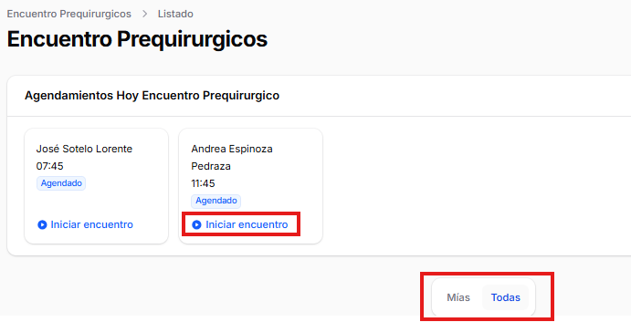

# Encuentro Prequirúrgico

## Descripción General
El Encuentro Prequirúrgico es el módulo donde se registra toda la información recopilada durante la evaluación prequirúrgica del paciente.
En ella también se incorporan formularios para el registro clínico, además de la gestión que conlleva los procesos siguientes.

## Visualización previa de encuentros

Para visualizar a los pacientes que se encuentran disponibilizados a su proximo encuentro prequirúrgico, es necesario que en el proceso anterior (Agenda Prequirúrgica) se haya cambiado el estado del agendamiento en "Agendado", si no se ha realizado este cambio, al iniciar la apertura del menú "Encuentro Prequirúrgico" no habrá ningun paciente disponible.
Plataforma posee la opción de visualizar los pacientes asignados al usuario de logueo como también los que se encuentran asignados a otros profesionales. Esta diferencia se logra al ingresar al botón Mías o Todas, para comenzar con el encuentro prequirúrgico se necesita ingresar a enlace "Iniciar encuentro". Se adjunta imagen con la información representada.

## Secciones del Encuentro

### Datos del Paciente
- Información demográfica

Visualización de datos demográficos del paciente provenientes de la solicitud emitida

- Antecedentes médicos
- Alergias y medicamentos actuales
- Historia quirúrgica previa

### Evaluación Médica
- Examen físico
- Signos vitales
- Evaluación de riesgo quirúrgico
- Clasificación ASA

### Exámenes Complementarios
- Laboratorio (hemograma, perfil bioquímico, etc.)
- Electrocardiograma
- Radiografías
- Otros estudios según protocolo

### Evaluación Anestésica
- Tipo de anestesia recomendada
- Evaluación de vía aérea
- Riesgos anestésicos
- Consentimiento informado

### Preparación Quirúrgica
- Indicaciones preoperatorias
- Ayuno
- Medicación prequirúrgica
- Recomendaciones especiales

## Finalizar Encuentro
Una vez completada toda la información, el encuentro debe ser:
- Revisado por el profesional responsable
- Firmado digitalmente
- Guardado en el expediente del paciente

## Impresión y Documentación
- Generar resumen de evaluación prequirúrgica
- Imprimir consentimientos informados
- Adjuntar resultados de exámenes
